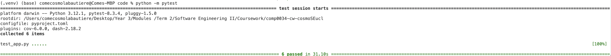

# Coursework 01 2025 COMPOO35
## Section 1: Application code

### 1.1 Design Principles

The structure of my Dash app adheres to key software design principles to ensure readability, scalability and maintainability.

- Separation of concerns:
    - Modular functions:
        - `process_data()`: Handles loading and preprocessing.
        - `filter_dataframe()`: Filters data based on user selections.
        - etc.
    - Callback Structure: By separating inputs and outputs, the callback structure simplifies the application's flow. If I need to modify how a particular element is updated, I can focus solely on the relevant callback without affecting other parts of the application.
- DRY: 
    - For instance, the `filter_dataframe()` function encapsulates all the logic for filtering the dataframe based on selected departments and year ranges instead of repeating this filtering code in multiple callbacks. 
    - Department colour mapping: Colour mapping is defined in a dictionary and reused across multiple charts.
- Readability: 
    - Descriptive function and variable names: 
        - `filter_dataframe()`
        - `update_wordcloud`
        - etc.
    - Docstrings: Explain the purpose, arguments and return values of each function.
    - Consistent formatting that meets PEP8 formatting.
- Performance: 
    - Data preprocessing: 
        - `process_data()` performs data loading and preprocessing upfront to minimise processing time for callbacks.

### 1.2 Independent research

I decided to include a word cloud as it provides a quick and intuitive way to identify the key topics in grant titles. I customised stopwords (using wordcloud's `STOPWORDS`) which enabled me to remove irrelevant terms (e.g., and, to etc.). Hence, the word cloud focuses on the most meaningful keywords. 

In addition, I integrated a sentiment analysis using NLTK's `SentimentIntensityAnalyzer` to provide insights into the tone of grant descriptions. The sentiment value for each individual grant can be seen in the `Sentiment` column of the Grants table at the bottom of the Dash app.

## Section 2: Test code

  

 Having only computed 6 tests, I prioritised testing UI interactions (clicking dropdowns, checking visualization updates)and was not necessaribly able to test anymore edge cases.

 ## Section 3: Linting

I used flake8 and linted each .py file running: `flake8 /Users/comecosmolabautiere/Desktop/Year\ 3/Modules\ /Term\ 2/Software\ Engineering\ II/Coursework/comp0034-cw-cosmoSEucl/coursework1/code/[filename]`

In `app.py` I encountered: 
- E501 "line too long (85 > 79 characters)" (26 occurences)
- E391 " blank line at end of file", W291 trailing whitespace (15 occurences)
- E122 continuation line missing indentation or outdented. (7 occurences)

I was able to solve each of the above linting errors.

In `test_app.py` I encountered:  
- W291: Trailing whitespace (12 occurences)
- E225: Missing whitespace around operator (3 occurence)
- W293: Blank line contains whitespace (5 occurences)
- E501: Line too long (more than 79 characters) (18 occurrence)
- W292: No newline at end of file (1 occurrence)
- W391: Blank line at end of file (1 occurrence)

I was not able solve the following:
- /Users/comecosmolabautiere/Desktop/Year 3/Modules /Term 2/Software Engineering II/Coursework/comp0034-cw-cosmoSEucl/coursework1/code/test_app.py:92:80: E501 line too long (101 > 79 characters)
- /Users/comecosmolabautiere/Desktop/Year 3/Modules /Term 2/Software Engineering II/Coursework/comp0034-cw-cosmoSEucl/coursework1/code/test_app.py:133:80: E501 line too long (126 > 79 characters)
- /Users/comecosmolabautiere/Desktop/Year 3/Modules /Term 2/Software Engineering II/Coursework/comp0034-cw-cosmoSEucl/coursework1/code/test_app.py:138:80: E501 line too long (102 > 79 characters)
- /Users/comecosmolabautiere/Desktop/Year 3/Modules /Term 2/Software Engineering II/Coursework/comp0034-cw-cosmoSEucl/coursework1/code/test_app.py:171:80: E501 line too long (96 > 79 characters)

This is because these lines contain XPath selectors and  Selenium WebDriver commands that cannot be meaningfully split across multiple lines without breaking the functionality. Breaking them causes syntax errors. Hence, to ensure maintainability and readability of the test code, I made an exception to the PEP 8 line length rule. 

## Section 4: References

### 4.1 Use of AI
I acknowledge the use of Microsoft Copilot (version GPT-4, Microsoft, https://copilot.microsoft.com/) to proofread the report, help me correct the linting errors according to the flake8 library and suggest tests ideas. 

### 4.2: Dataset attribution

The dataset is made available by the Greater London Authority (GLA) under the Open Government License v3.0. You may use and reuse the data, subject to the conditions outlined in the license. Contains public sector information licensed under the Open Government Licence v3.0.

